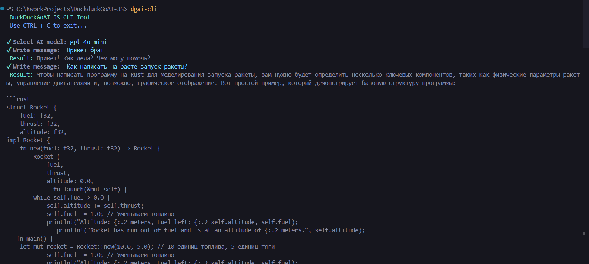

# DuckDuckGoAi-JS
Wrapper over private API DuckDuckGoAI on TS/JS

⚠️ _Currently under development_
# Example of working with API
```typescript
import DialogManager  from "../src/core/service/DialogManager.ts";
import { ModelType } from "../src/core/repository/ModelType";

async function main(){
    try{
        // Creating dialog manager and set AI Model
        const dialogManager = new DialogManager(ModelType.GPT4oMini);

        // Get full message
        const result = await dialogManager.sendMessageChat("How to make http request in python?", false);
        console.log(result.message);

        // Get stream
        // in working...
    } catch(err){
        console.error(err);
    }
}

main();
```
# Example of working with CLI
Running:
```bash
dgai-cli
```


# Disclaimer
By using this package you automatically accept the user agreement
https://duckduckgo.com/duckai/privacy-terms

I do not bear any responsibility for violation of ToS